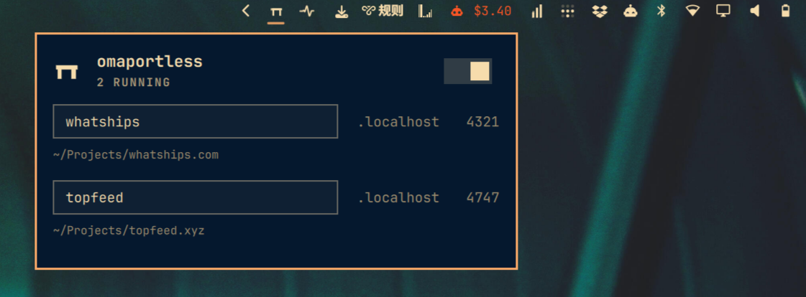

# omaportless

Give every local dev server a named `.localhost` address, and rename it from the Omarchy bar.



This plugin does **not** wrap `npm run dev`. It scans listeners that are already running, then reverse-proxies `http://name.localhost` to that port.

On systemd-resolved (and most browsers), `*.localhost` already maps to loopback, so no `/etc/hosts` edit is required.

## Install

Needs Rust once, to compile the proxy (`omarchy pkg add rust` if `cargo` is missing).

```sh
omarchy plugin add https://github.com/dingyi/omaportless.git --enable
~/.config/omarchy/plugins/dingyi.omaportless/setup
```

`setup` builds the binary and starts a user systemd service. The panel switch can also run `install` after that.

## Usage

- Left click opens the panel
- Right click starts or stops the proxy
- Middle click opens `http://localhost` (the index of named apps)
- Edit a row's name and press Enter to pin `name.localhost`
- Click `.localhost`, the port, or the project path to open it; right click copies the URL

Keys in the panel: `t` proxy, `o` index, `r` refresh.

If something else already owns port 80, omaportless listens on 7777 and, with one polkit prompt, installs a loopback-only nftables redirect so `http://name.localhost` still works with no port. Unknown hosts are passed through to `127.0.0.2:80`.

```sh
~/.config/omarchy/plugins/dingyi.omaportless/omaportless enable-port80
```

Names are stored in `~/.config/omaportless/config.json`, keyed by project directory when `/proc/<pid>/cwd` is readable.

## Remove

```sh
~/.config/omarchy/plugins/dingyi.omaportless/omaportless uninstall
omarchy plugin disable dingyi.omaportless
```
